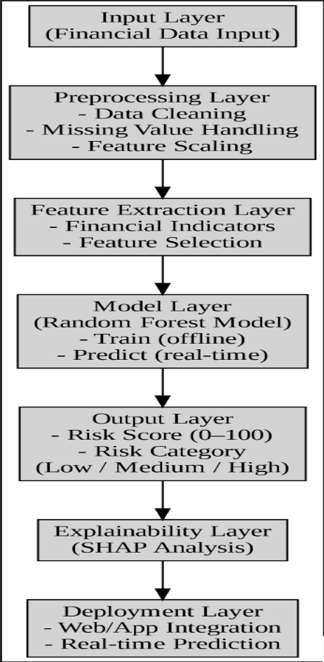
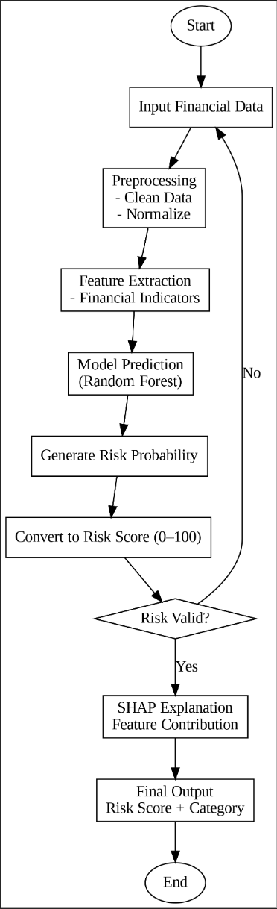
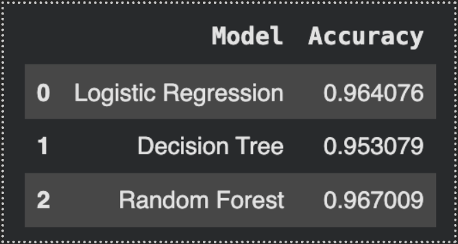
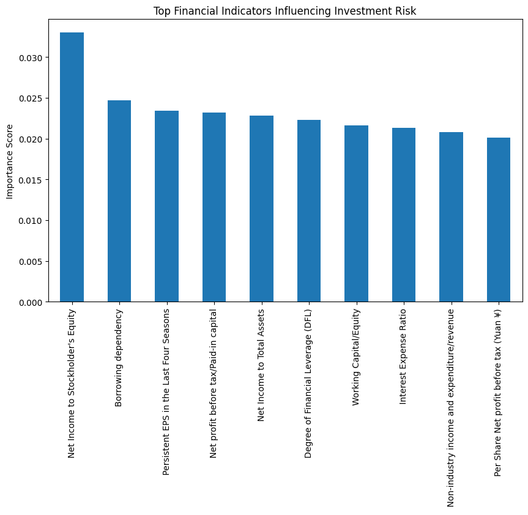
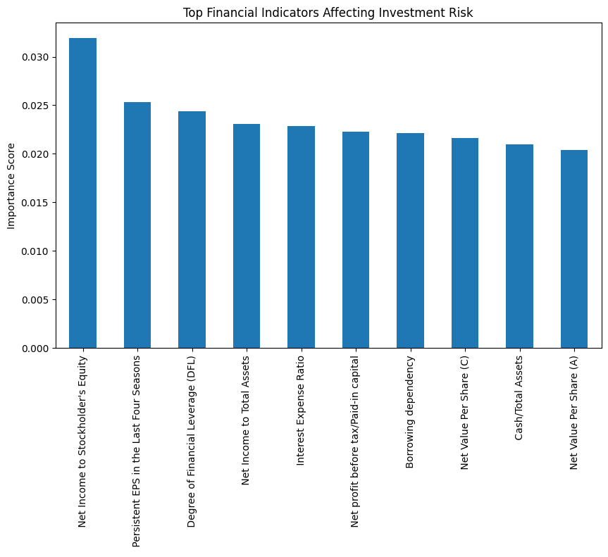
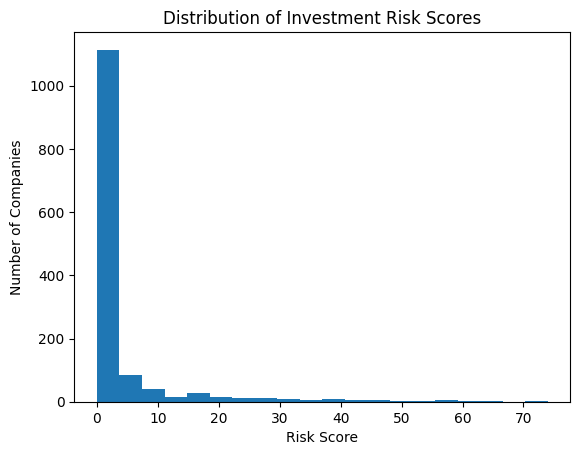
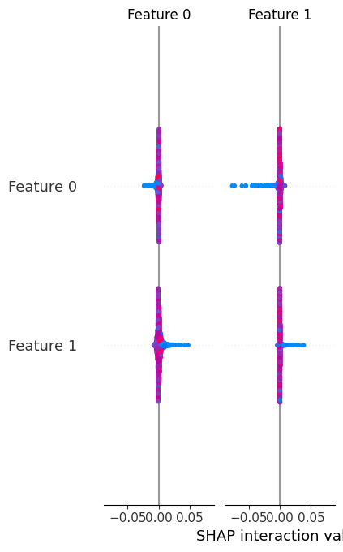

# Data-Driven Investment Risk Prediction Using Machine Learning and SHAP-Based Interpretability

<p align="center">


</p>

---

# Overview

Investment risk assessment plays a vital role in financial decision-making. Traditional methods depend heavily on manual financial analysis, making the process time-consuming, subjective, and difficult to scale.

This project presents a **Machine Learning-based Investment Risk Prediction System** that analyzes financial indicators to classify investment risk accurately. The system compares multiple machine learning algorithms and integrates **SHAP (SHapley Additive exPlanations)** to provide transparent and interpretable predictions.

Additionally, the project introduces a **Risk Score Generation System**, converting prediction results into numerical scores that simplify investment analysis and decision-making.

---

# Objectives

- Develop a machine learning framework for investment risk prediction.
- Compare multiple classification algorithms.
- Identify the most accurate prediction model.
- Improve prediction transparency using Explainable AI (SHAP).
- Generate numerical investment risk scores.
- Analyze the contribution of important financial indicators.

---

# Key Features

-  Investment Risk Prediction
-  Machine Learning Classification
-  Random Forest Classifier
-  Financial Indicator Analysis
-  SHAP Explainable AI
-  Risk Score Generation
-  IEEE Research Paper Included
-  Complete Project Report Included

---

#  Technologies Used

| Category | Technologies |
|-----------|--------------|
| Programming Language | Python |
| Development Platform | Google Colab |
| Data Processing | Pandas, NumPy |
| Machine Learning | Scikit-learn |
| Data Visualization | Matplotlib |
| Explainable AI | SHAP |

---

#  Dataset

**Dataset Used:** Polish Companies Bankruptcy Dataset

The dataset contains financial information collected from companies over multiple years. It includes profitability, liquidity, leverage, operational performance indicators, and bankruptcy labels.

The dataset is widely used for:

- Bankruptcy Prediction
- Financial Risk Analysis
- Investment Risk Prediction
- Machine Learning Classification

---

#  Machine Learning Models

The following algorithms were implemented and compared:

- Logistic Regression
- Decision Tree
- Random Forest

Among these models, **Random Forest** achieved the best overall performance.

---

#  Model Performance

| Model | Accuracy |
|--------|----------|
| Logistic Regression | **96.40%** |
| Decision Tree | **94.79%** |
| Random Forest | **96.63%** |

 **Random Forest** demonstrated the highest prediction accuracy while maintaining excellent robustness and stability.

---

# 🔄 Project Workflow

```text
Financial Dataset
        │
        ▼
Data Preprocessing
        │
        ▼
Feature Scaling
        │
        ▼
Train-Test Split (80:20)
        │
        ▼
Machine Learning Models
(Logistic Regression,
Decision Tree,
Random Forest)
        │
        ▼
Model Evaluation
        │
        ▼
Risk Prediction
        │
        ▼
Risk Score Generation
        │
        ▼
SHAP Explainability
        │
        ▼
Final Investment Risk Assessment
```

---

#  Project Visualizations

##  System Architecture

<p align="center">

</p>

---

##  Process Flow Diagram

<p align="center">

</p>

---

##  Model Accuracy Comparison

<p align="center">

</p>

---

##  Feature Importance Analysis

<p align="center">

</p>

---

##  Top Financial Indicators

<p align="center">

</p>

---

##  Investment Risk Score Distribution

<p align="center">

</p>

---

##  SHAP Summary Plot

<p align="center">

</p>

---

#  Key Findings

- Random Forest achieved the highest prediction accuracy (**96.63%**).
- Financial profitability and leverage indicators significantly influence investment risk.
- SHAP improves model transparency by explaining prediction decisions.
- Risk Score Generation enhances practical usability.
- The proposed system provides reliable investment risk assessment using financial indicators.

---

#  Research Paper

This repository includes the complete IEEE research paper based on this project.

### **Paper Title**

**Data-Driven Investment Risk Prediction Using Machine Learning and SHAP-Based Interpretability**

---

#  Project Report

A comprehensive academic project report is included, covering:

- Introduction
- Industry & Company Profile
- Literature Review
- Research Methodology
- Data Analysis
- Results
- Conclusion

---

#  Repository Structure

```text
Investment-Risk-Prediction-Using-Machine-Learning
│
├── README.md
├── Risk_assessment_model.ipynb
├── requirements.txt
├── LICENSE
├── IEEE_research_paper.pdf
├── Minor_project_report.docx
│
├── System_architecture.png
├── process_flow_diagram.png
├── Model_accuracy_comparison.png
├── feature_importance_1.png
├── feature_importance_2.png
├── risk_score_distribution.png
└── shap_summary_plot.png
```

---

#  How to Run

### 1. Clone the Repository

```bash
git clone https://github.com/ayanshaikh/Investment-Risk-Prediction-Using-Machine-Learning.git
```

### 2. Install Required Libraries

```bash
pip install -r requirements.txt
```

### 3. Open the Notebook

Run:

```
Risk_assessment_model.ipynb
```

using **Google Colab** or **Jupyter Notebook**.

---

#  Future Enhancements

- Real-time financial data integration
- Deep Learning models
- Stock market prediction
- Streamlit Web Application
- Cloud Deployment
- Portfolio Recommendation System
- REST API Integration

---

#  Citation

If you use this project for academic or research purposes, please cite:

> **Ayan Shaikh, Anushka Pardeshi, Dr. Karthika P. Devan**
>
> *Data-Driven Investment Risk Prediction Using Machine Learning and SHAP-Based Interpretability.*

---

#  Author

## **Ayan Shaikh**

 Bachelor of Computer Science

 Vishwakarma University, Pune

 Machine Learning | Artificial Intelligence | Data Science | Python

---

#  Support

If you found this project useful, please consider giving it a ⭐ on GitHub.

It helps others discover the project and motivates future development.

---

##  Acknowledgement

This project was developed as part of the Minor Project at **Vishwakarma University** under the guidance of **Dr. Karthika P. Devan**. The project explores the application of machine learning and explainable AI techniques for improving investment risk assessment using financial data.
